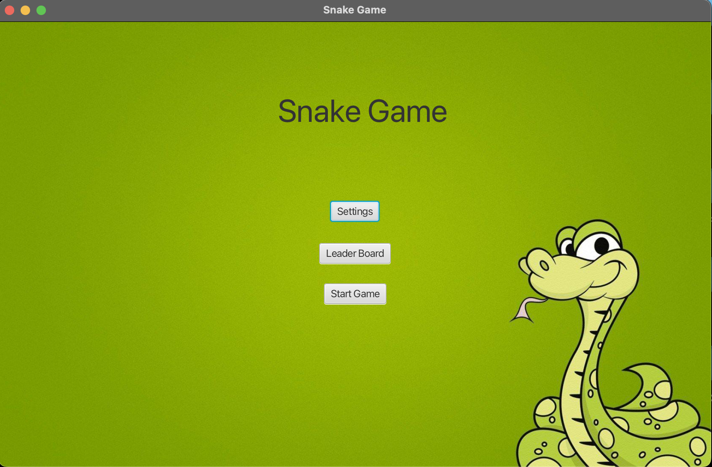
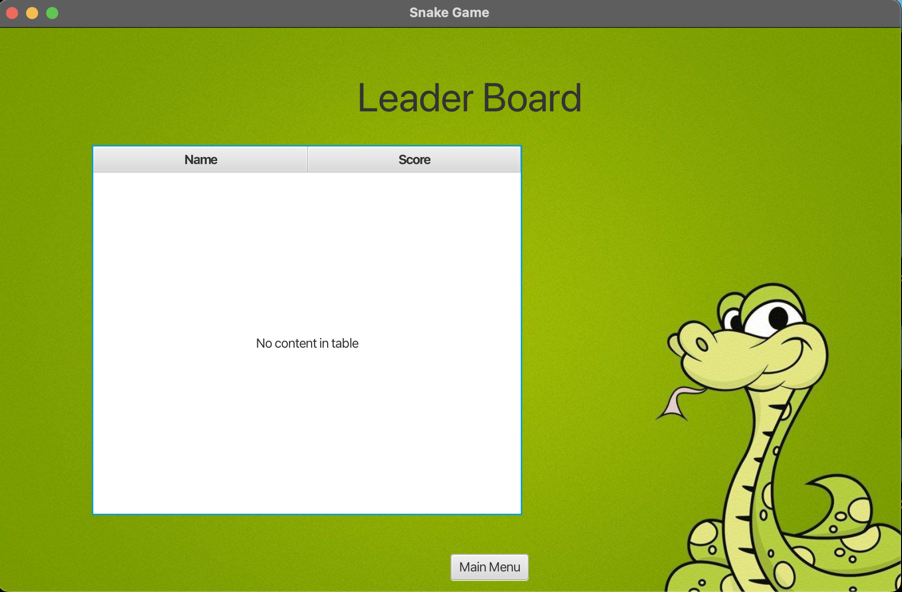
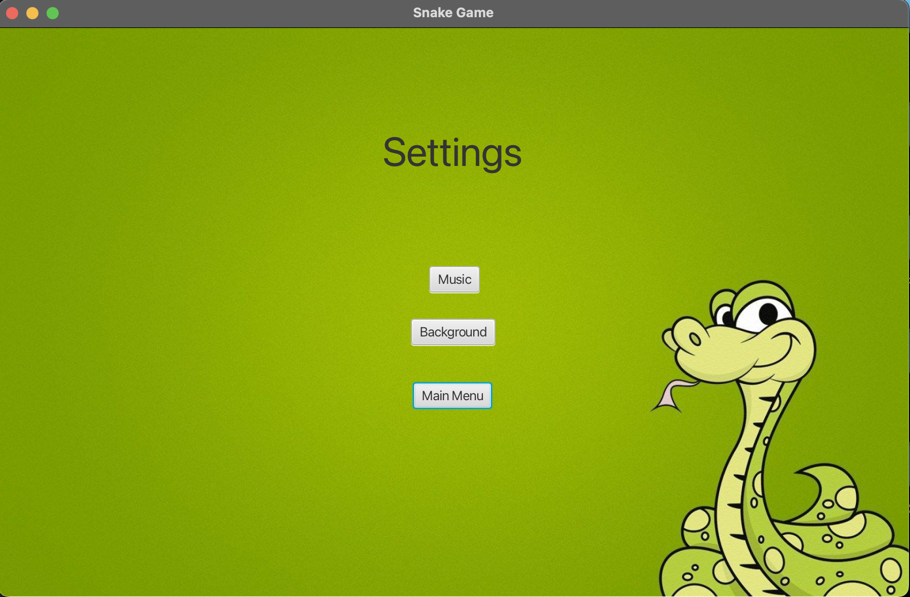
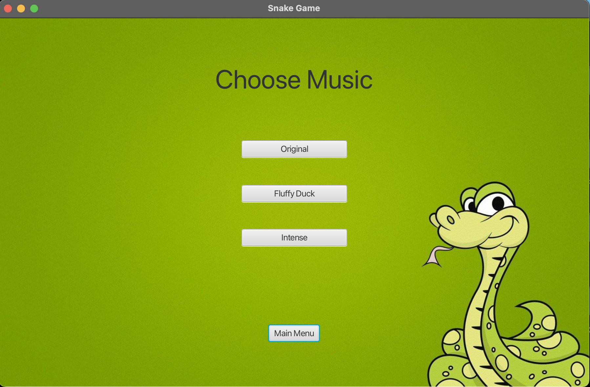
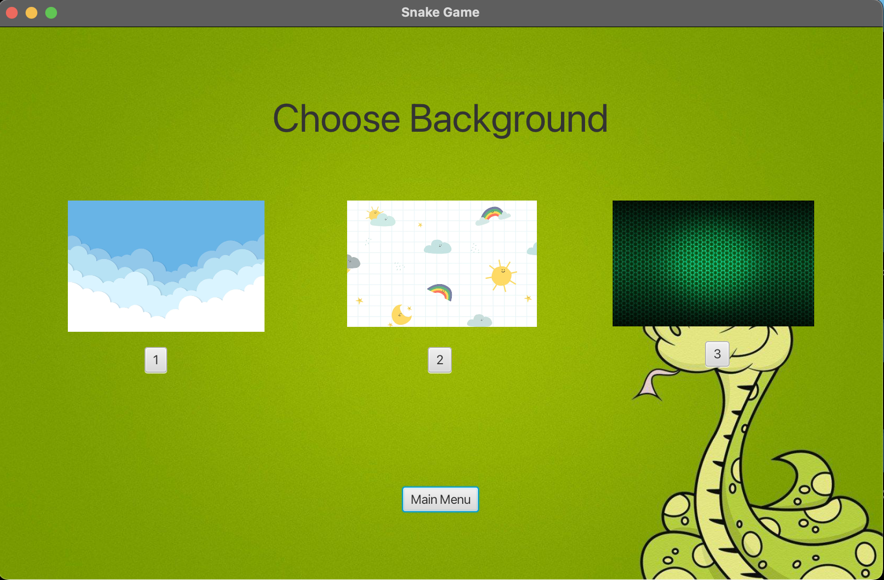
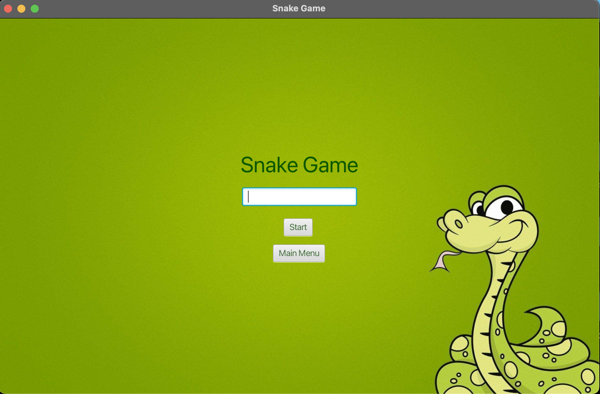
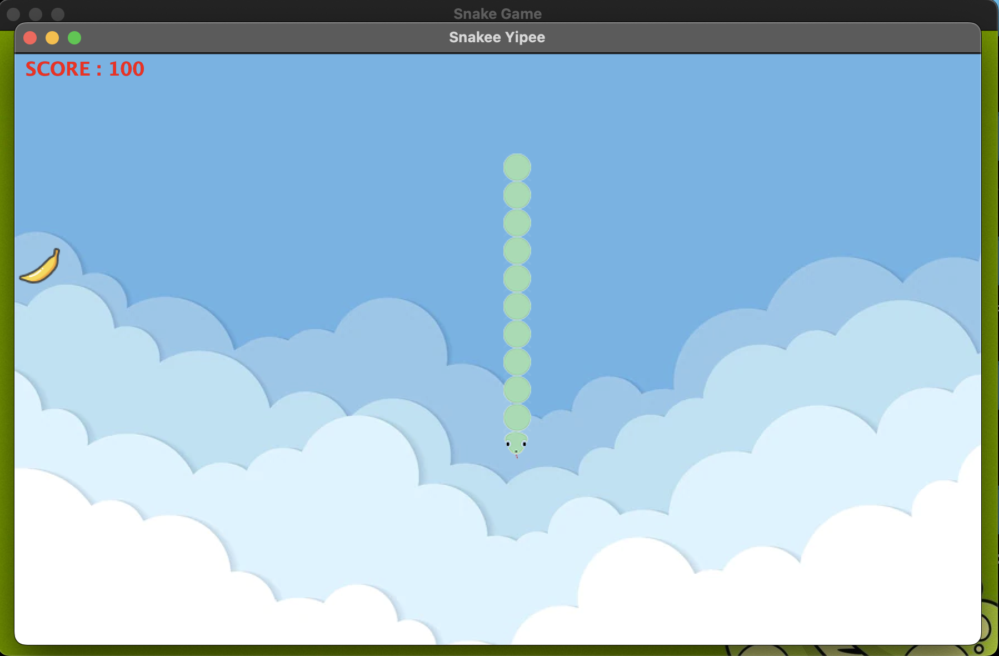
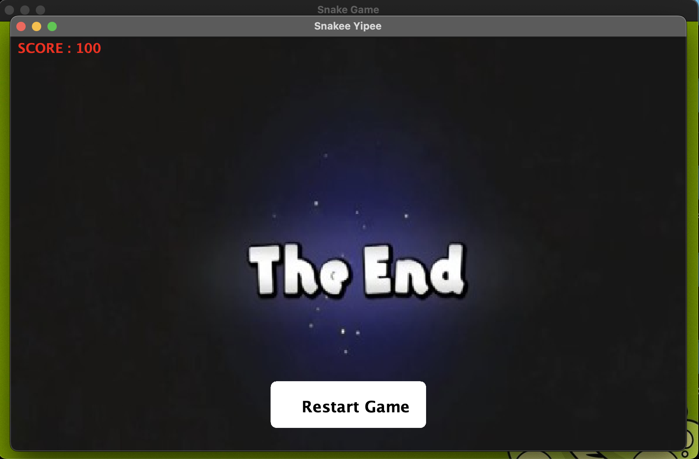

# SnakeGame

# Snake Game Project

This repository contains my implementation of the Snake Yipee game provided in Java using JavaFX. 
The game features a menu screen which leads onto start screen, settings and leaderboard.

## How to Play

1. Clone this repository to your local machine.
2. Open the project in your Java IDE (e.g., IntelliJ IDEA or Eclipse).
3. Run the `SnakeApplication` class to start the game.
4. If you would like to pause the game just press the *Spacebar*
5. Enjoy playing the Snake game!

# Project Screenshots

## Game Interface

*Figure 1: The main interface of the Snake Game.*

## Leaderboard

*Figure 2: Leaderboard displaying top scores.*

## Settings

*Figure 3: Settings screen for customization.*

## Music Screen

*Figure 4: Set the music for the game.*

## Background Screen

*Figure 4: Set the background for the game.*

## Start Screen

*Figure 4: Initial screen for starting the game.*

## Play Screen

*Figure 4: GamePlay.*

## End Game Screen

*Figure 4: End of the game.*

